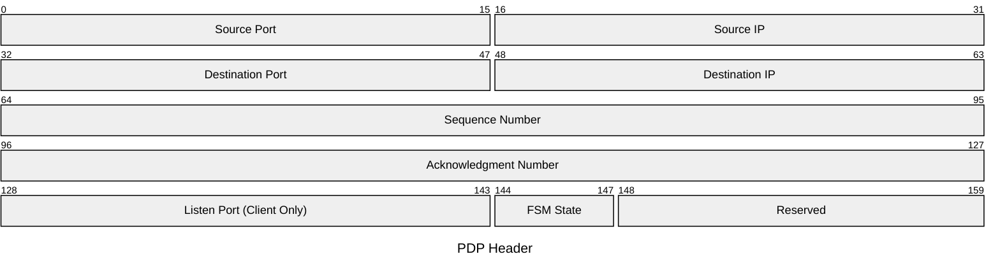

# COSC 448 - Directed Studies in Computer Science

## Persistent Datagram Protocol (PDP)

PDP an experimental combination of TCP and UDP called Persistent Datagram Protocol (PDP). The goal of PDP is to enable a persisten connection between two users over UDP.

To achieve this, there is a new PDP header which will be used to establish a connection between a client and a server:

### 3-Way Handshake

A connection between a client and a sever is established in a similar way to TCP's 3-Way Handshake. First, the client sends a `SYN` datagram to the server's open `listen` socket. The datagram's payload contains a TCP header in which the source port, destination port, SYN flag, seq #, and ack # have been set. Additionally, the payload contains a PDP header which has the source port, source IP, dest IP, seq number = 0, ack number = 0, listen port, and FSM = CLOSED filled out. During the handshake process, the client and server will update their PDP header using info received from the each other until a connection is established.

- This will be more fleshed out in the future. E.g., clearly we don't really need to store the source port or dest port b/c they're already in the TCP packet, but I'm leaving it in there for now.

Some considerations to be made:

**Approach #1:** The listen socket maintains a lookup table of PDP headers for checking if an incoming SYN datagram is a valid connection request? When it receives a datagram w/ the SYN flag set to 1, it uses the 4-tuple in the PDP header to search a lookup table and determine if there is already an open socket for the incoming request. 
- If there isn't open a new socket and send a SYN-ACK response to continue the handshake.
    - For each new connection do we assign the new socket its own port number (how to determine new socket's port?), meaning we don't have to worry about all of the demuxing occuring at a single port, or do we implement it TCP-style, where e/a socket is just uniquely identified by the 4-tuple, but the server port number is the same for all of the sockets?
- If there is already an open socket, send a FIN back to the client in addition to a PDP header containing the existing connection's info.

The listen socket also manages closing connections. I.e., it will receive a FIN from the client, begin the 4-way handshake to close the connection, and close the corresponding server-side socket.

**Approach #2:** The listen socket DOES NOT maintain a lookup table. Instead, we assume that all incoming datagrams to the socket are either a SYN datagram to establish a connection, or a FIN datagram to terminate a datagram.
- Problem with this is that it _could_ be abused. A client could send several connection requests and be allocated several sockets on the server, and the server has no way of knowing this.
- However, if we go with the approach where all of the sockets have the same server port number, this wouldn't be an issue because the listen socket would create a 4-tuple that already exists, and hence multiple socket abuse doesn't occur.

**Consideration:** Should the listen socket be present for the entire handshake process, or should the following occur:
1. Client sends SYN to server
2. Server recieves SYN, creates new socket, tells new socket to send SYN-ACK to Client.
3. Rest of handshake and connection termination is done between the client and its personal socket.

I want to consider this because in TCP, the client is allowed to add its first actual data payload when it sends the final ACK to establish the connection. If the listen socket performs the entire thing, this will not be possible.
- Okay, technically it would be possible, but it'd require more overhead.

Regardless, after a new socket is opened, the server should `bind()` it. After server sends SYN-ACK, it should `connect()` to client's socket. After client sends ACK, it should `connect()` to server's socket.
- After client receives SYN-ACK, it should modify `server_addr` to store the new socket's info. Another option is to have a 3rd `sockaddr_in` just for the listen socket since it's needed for connection termination too.

### After Connection Establishment

After the 3-way handshake is complete, the client and server should have complete PDP headers, and it will not be necessary to include the TCP header in the payloads until the connection should be terminated.